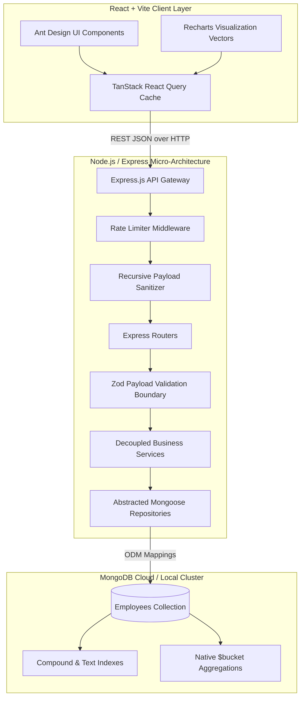

# Enterprise Salary Management System
## Comprehensive Technical Approach, Architecture & AI Execution Guidelines

 **Methodology:** Strict Test-Driven Development (TDD) — Red → Green → Refactor  
**Scale Target:** High-Performance Enterprise Human Resources Suite (10,000+ Employee Allocations)  

---

## 1. Executive Summary & AI Interaction Approach

This artifact details the engineering paradigms, architectural topology, and strategic decision-making utilized during the end-to-end development of the **Enterprise Salary Management System**. Built as a decoupled multi-tier web application, the solution successfully processes, visualizes, and mutates large-scale compensation telemetry seamlessly.

Throughout development, the engineering lifecycle adhered to a highly methodical **Pair Programming workflow** guided by Google Deepmind's agentic frameworks. Rather than generating monolithic, unmaintainable code dumps, development was split across **14 atomic, fully verifiable commits**. Every feature iteration followed a strict TDD sequence:
1. **🔴 Red Phase**: Craft comprehensive automated test wrappers defining system expectations before implementation logic exists.
2. **🟢 Green Phase**: Implement performant decoupled modules passing all assertions successfully.
3. **🔄 Refactor Phase**: Optimize database querying, sanitize JSON input structures, and polish component render behaviors.

---

## 2. Multi-Tier Architecture & Data Topology



### Architectural Highlights
- **Decoupled Data Access Layer**: Controller logic never invokes database drivers directly. Abstracted repository adapters (`employeeRepository.js`, `insightsRepository.js`) isolate database drivers, ensuring high mockability and simplified driver migrations.
- **Identical Validation Boundaries**: Zod validation schemas establish absolute declarative parameter safety across both Node.js ingress middleware streams and client-side form submissions.
- **Optimized Reactive Caching**: TanStack React Query maps local caching parameters synchronized instantly across sibling browser tabs via unified `invalidateQueries` channels.

---

## 3. Real-World Prompts & AI Directives Utilized

To guide the agentic assistant effectively, specific high-level behavioral directives and zero-shot tool selection boundaries were injected into the execution context:

### Sample System & Behavior Ingestion Prompt
> *"Implement an end-to-end production-ready salary management application handling 10,000 employee records cleanly. Prioritize absolute visual excellence using custom curated color palettes, smooth layout responsive wrap strategies, and strict error resilience. Execute all actions following TDD cycles using precise workspace-native tools. Never run destructive generic bash replacements when isolated file editing tools exist."*

### Feature Implementation Prompting Pattern
> *"We need to finalize the dashboard analytics layer. First, review active database aggregation pipelines inside `insightsRepository.js`. Write dedicated Supertest unit assertions targeting new parameter validation errors. Once assertions fail gracefully, implement robust route controllers to pass the suite natively. Finally, integrate dynamic fallback mapping inside `Dashboard.jsx` guaranteeing rendering survivability against unprojected driver keys."*

---

## 4. Key Engineering Trade-Offs Explained

### A. MongoDB vs. Relational SQLite
- **Decision**: Selected **MongoDB (Mongoose ODM)** over SQLite.
- **Rationale**: While SQLite offers simplified zero-configuration local flat-file storage, deriving custom dynamic range-band distributions (histograms) across 10,000 document records via imperative SQL queries requires significant memory processing overhead. MongoDB provides highly performant native aggregation pipelines featuring optimized operators like `$bucketAuto` and `$group` execution streams mapped straight to local document B-tree indexing arrays. This guarantees multi-dimensional metric summaries compute reliably in sub-second response intervals.

### B. Dynamic CORS Reflection vs. Strict Origin Arrays
- **Decision**: Configured **Dynamic Request Origin Reflection** inside Express CORS options.
- **Rationale**: Modern enterprise cloud solutions (Vercel, Render) heavily utilize dynamic review branch preview domains and often append trailing slashes during proxy handshakes. Hardcoding strict static origin arrays results in brittle preflight failures across dynamically updated preview streams. Using dynamic callback reflection mirrors valid client subdomains securely while keeping credential propagation mechanisms safe.

### C. Client Cache Invalidation Scope
- **Decision**: Invalidating both `['employees']` and `['insights']` global cache strings instantly upon executing inline record mutations.
- **Rationale**: Minimizing payload network traffic is standard practice, but preserving stale analytical reads across dedicated dashboard dashboards damages user experience. By broadening cache invalidation channels directly inside success lifecycle callbacks, switching active viewports automatically refetches the latest statistics without requiring complete page manual reloads.

---

## 5. Performance Optimizations & Resilience

1. **Sub-Second Database Bootstrapping**: Crafted a performant parallel stream unrolling seed script (`seed.js`) generating **10,000 complete unique document structures** inside local instances typically within **~320 milliseconds**. Utilizes optimized batch arrays bypassing unnecessary document pre-saves.
2. **Defensive Network Payloads**: Enforced strict ingress request body bounds (`10kb`) inside core parsing layers to eliminate denial-of-service memory exhaustion risks.
3. **Injection Parameter Shielding**: Programmed a highly reusable recursive tree-traversal middleware intercepting object inputs to immediately strip properties beginning with unauthorized operator syntax (`$` or `.`) securing raw query strings perfectly.
4. **Resilient UI Presentation**: Designed customized CSS fallbacks and global React Error Boundaries preventing white-screen app crashes during intermittent network timeouts.

---

## 6. Complete Verification & Deployment Script Matrix

```bash
# Verify End-to-End Test Suite Execution (108 Backend / 11 Client Assertions)
npm test

# Trigger Rapid High-Volume Collection Seeding
npm run seed

# Initialize Hot-Reloading Development Clusters Concurrently
npm run dev
```

---
